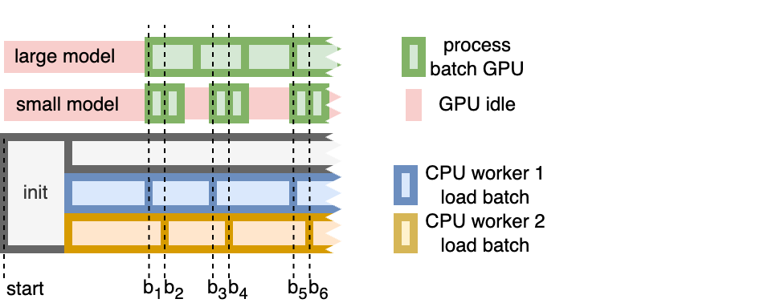

# Detailed Analysis: batch sizes & number of workers -> load data times

#### Pytorch data loader

- parallel data loading: https://pytorch.org/docs/stable/data.html#multi-process-data-loading
    - interesting parameters to look at: pin_memory & pin_memory_device (seems like we can load the batches into a
      pinned memory region on the GPU)
- when setting the `num_workers` parameter of the dataloader to a positive value *n*, *n* many worker processes will
  be started that load batches in parallel
- **every worker is responsible for loading one batch** but there are discussions of how to adjust that if loading
  the first batch is the bottleneck in the training process
    - https://discuss.pytorch.org/t/the-samples-in-one-batch-are-loaded-in-parallel-while-enumerating-dataloader/159163
    - https://discuss.pytorch.org/t/multiple-workers-for-single-batch/126473

#### Effect of number of workers and inference time

- for now let's assume we hava a fixed batch size and 2 worker processes
- the situation is visualized below
- 
- at fist the dataloader is initialized and two additional worker processes are spawned
- each worker process loads a batch independently
- this means, the GPU waits longest to get the first batch (b1), but batch (b2) is ready almost immediately after so the
  delay for loading b2 is very small
- while waiting for the first batch the GPU idles, weather or not the GPU idles also while waiting for the second batch
  depends on the duration of the inference:
    - if the model is large and the inference takes long, a new batch will always be ready
    - if the model is small and the inference is faster than loading the data, the GPU might not have to wait for b2,
      but it will most likely wait for b3 because one worker process needs longer to load one batch than performing
      inference on two tuples
- to verify this behaviour, we perform the following experiment:

#### Experiment

- we run a micro benchmark using the following script [data_loading_experiment.py](data_loading_experiment.py)
- it can be executed on the server by adapting the
  script [run_data_loading_exp_on_server.sh](run_data_loading_exp_on_server.sh)
- the script runs over the follwoing configurations
    - *batch size*: 32, 128, 256, 512, 1024
    - *number of workers*: 1, 2, 4, 8, 32, 48, 64
    - *sleep duration*: to simulate the time it would take to perform inference
        - None -> no sleep -> simulate small model/no inference cost
        - 2s -> simulates a larger model/longer inference time
    - dataset_type
        - imagenette: uses the imagenette dataset with the standard inference pre-processing pipeline for imagenet
          models
            - not every image has the same size ~=117 KB -> 0.12 MB
        - preprocessed_ssd: saves data in the shape (3,224,224) on SSD, meaning there is no data loading require
            - here a single item is 3*224*224*4 Byte ~= 0.6MB large, meaning batch has the following sizes:
                - 32: 19.2 MB
                - 128: 76.8 MB
                - 256: 153 MB
                - 512: 306 MB
                - 1024: 612 MB

#### Results

- the experiment was executed on the hardware as described in [readme.md](..%2F..%2F..%2Fexp_environment%2Freadme.md)
  and is also documented in every single result file
- the single result files can be found here: https://nextcloud.hpi.de/f/11781487

##### Effect of batch size

##### Effect of number of workers

##### Effect of sleep time

##### Effect of dataset type
