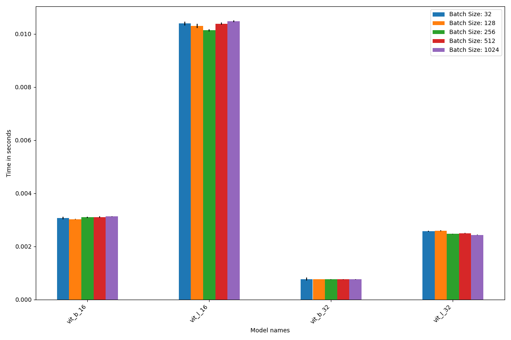

# Detailed Analysis: batch sizes -> inference times

#### Experiment

- we run a micro benchmark using the following script [inference_time_experiment.py](inference_time_experiment.py)
- it can be executed on the server by adapting the
  script [run_inference_time_exp_on_server.sh](run_inference_time_exp_on_server.sh)[run_data_loading_exp_on_server.sh](run_data_loading_exp_on_server.sh)
- the script runs over the following configurations given a fixed set of models
    - *batch size*: 32, 128, 256, 512, 1024

#### Results

- the experiment was executed on the hardware as described in [readme.md](..%2F..%2F..%2Fexp_environment%2Freadme.md)
  and is also documented in every single result file
- the single result files can be found here: https://nextcloud.hpi.de/f/11798608
- plotting code can be found in [eval](eval), the actual plots in [plots](plots)

#### Effect of batch size

- the following plots show the inference times **normalize** to time per item, meaning for example the abs time for
  batch size 1024 was divided by 1024 and is actually 1024 X higher

- Inference times depending on batch times for **Convolutional models**
    - we see that a small batch size such as 32 does not fully utilize the compute and parallelization capabilities of
      the GPU and is thus less efficient than higher batch sizes on a per item metric. For example for batch size 256
      the total time to process the batch is longer, but the time per item is shorter

  

- Inference times depending on batch times for **transformer models**
    - here we see that the largest batch size is not always the fastest in terms of per item inference time
    - 256 seems to be a good fit as it is also described on the NVIDIA website (they state multiple of 256)
    - the general statement that a larger batch size improves parallelization and efficiency (as stated on the website
      as well) we can not confirm, but we also have to keep in mind that he differences are marginal
        - https://docs.nvidia.com/deeplearning/performance/dl-performance-fully-connected/index.html
        - interpretation
            - we see that larger batch sizes have less overhead per item until a certain point e.g. batch size of 256
            - our interpretation: ideally we would place the kernel for one layer on one multiprocessor and for the next
              layer place the kernals on the data locality ideal multiprocessor (so that we can reuse the intermediate
              result that we produced by the previous kernal), but if the batch size is larger than the
              available number of processors this does not happen, and we might lose caching effects.

  

